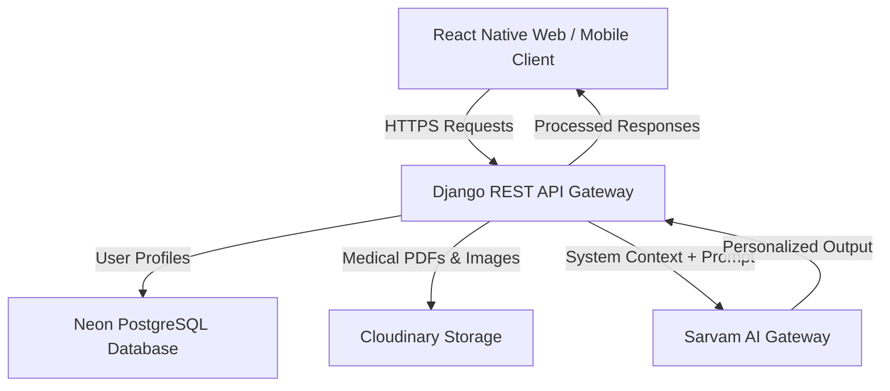

# JeevanSetu AI 🩺
### Your Personal AI-Powered Health Companion
> *HackHazards '26 Submission*

[](https://jeevan-setu-ai-nine.vercel.app)
[](https://jeevansetuai.onrender.com)
[](https://www.python.org/)
[](https://expo.dev/)

JeevanSetu AI is designed to transform scattered, complex, and intimidating medical documents into a single, continuous, and easily understandable personalized health journey. By converting raw prescriptions, lab reports, and doctor notes into structured, chronological events, JeevanSetu AI empowers individuals to navigate their health history with clarity and confidence. It bridges the gap between complex clinical terminology and user understanding, offering profile-aware AI insights and companion conversations grounded in the user's documented health facts.

---

## 💡 Why JeevanSetu AI?

*   **The Fragmented Reality:** Medical records are usually scattered across different labs, hospitals, and physical folders. Keeping track of long-term health events is a challenge.
*   **The Limit of Generic AI:** Standard AI chat tools lack context. If you ask for a dietary plan, they will give a generic answer unless you manually type out all your allergies, conditions, and preferences every single time.
*   **The JeevanSetu Bridge:** JeevanSetu AI bridges these gaps by securely organizing your reports in a structured timeline while grounding AI conversations in your stored medical profile. Your health companion knows your conditions and preferences automatically, creating a truly continuous, personalized care loop.

---

## 📈 Complete Application Flow

```
Registration ➔ Onboarding ➔ Health Profile ➔ Dashboard ➔ Upload Medical Report ➔ AI Analysis ➔ Health Vault ➔ Report Summary ➔ Health Timeline & Insights ➔ Personalized AI Companion
```

1.  **Registration:** Secure user registration and JWT-based authentication session management.
2.  **Onboarding:** Gather basic demographics (name, date of birth) and language preferences.
3.  **Health Profile:** Log blood group, list medical conditions, chronic illnesses, allergies, and custom AI personalization rules.
4.  **Dashboard:** Displays your personalized health snapshot and profile completion status.
5.  **Upload Medical Report:** Securely upload a PDF or image medical report.
6.  **AI Analysis:** The system processes uploaded reports and generates structured AI-powered analysis.
7.  **Health Vault:** Organizes uploaded reports in a searchable personal Health Vault.
8.  **Report Summary:** Instantly view structured, easy-to-understand summaries of uploaded medical reports.
9.  **Health Timeline & Insights:** Compiled chronological timeline of health events and analyzed report history.
10. **Personalized AI Companion:** Interactive chat companion referencing the user's relevant health context.

---

## 🌟 Implemented Features (Working Now)

*   **🔒 Secure Authentication:** Custom user registration, login, token refresh, and logout endpoints (`/api/v1/auth/*`).
*   **📂 Medical Health Vault:** Cloud-based PDF/Image medical report uploads stored securely on Cloudinary.
*   **📊 Chronological Timeline:** Organized health events and analyzed report history compiled automatically into an interactive timeline view.
*   **💡 AI Health Insights:** Automatic summaries, medical report analyses, and personalized health stories.
*   **💬 Profile-Aware AI Companion:** A chatbot that references the user's stored health parameters (such as documented allergies or chronic conditions) during relevant health conversations.
*   **🚨 Emergency Medical Card:** A first-responder SOS card displaying blood group, allergies, conditions, and emergency contact details. Features a quick clipboard export for messaging.
*   **🌐 Language Preference:** Support for English, Hindi (हिन्दी), and Tamil (தமிழ்) language preferences (updates the companion prompt context to align with the user's chosen language).

---

## 🧠 Personalization in Action: Context-Aware Responses

Unlike generic chatbots where you must repeatedly type out your medical history, JeevanSetu AI references the user's relevant health context automatically.

### Tested Personalization Scenario
*   **Health Profile:** A user registers an **Egg Protein Allergy** in their profile.
*   **Prompt:** The user queries the AI companion: *"Suggest me a high-protein breakfast."*
*   **AI Action:** The system injects the profile context into the LLM system instructions. Because JeevanSetu remembers the stored health context, the user does not need to mention the allergy. The companion automatically warns the user, avoids eggs, and suggests allergy-safe alternatives like a **Greek Yogurt Power Bowl**, **Protein-Packed Smoothie**, or **Hearty Oatmeal**.

---

## 🛠️ Architecture & Tech Stack



*   **Frontend:** React Native (0.86.0), Expo SDK 57.0.4, Expo Router, TypeScript, NativeWind v4 (Tailwind CSS), Zustand state store.
*   **Backend:** Python 3.12.8, Django 5.1.15, Django REST Framework 3.17.1, WhiteNoise 6.8.2 (static file serving).
*   **Database:** Neon PostgreSQL (production) & SQLite (local development fallback).
*   **File Storage:** Cloudinary.
*   **AI Engine:** Sarvam AI API integration.

---

## 👥 Team
*   **Team Leader:** Arunnissal B
*   **Team Members:** Arun T, Harshavarthanar K S

---

## 📸 Screenshots
*(Screenshots will be uploaded here upon final UI verification)*
*   [Welcome Screen Placeholder](https://placehold.co/300x600/teal/white?text=Welcome+Screen)
*   [Dashboard Placeholder](https://placehold.co/300x600/teal/white?text=Dashboard+Overview)
*   [Medical Vault Placeholder](https://placehold.co/300x600/teal/white?text=Medical+Vault)

---

## 🎥 Demo Video
🎥 *Demo video link will be added here prior to final submission.*

---

## 🚀 Local Development Setup

### 1. Backend Setup
1. Navigate to the backend directory:
   ```bash
   cd backend
   ```
2. Create and activate a virtual environment:
   ```bash
   python -m venv venv
   source venv/bin/activate  # On Windows: venv\Scripts\activate
   ```
3. Install dependencies:
   ```bash
   pip install -r requirements.txt
   ```
4. Create a `.env` file based on `.env.template` and add your keys:
   ```env
   DEBUG=True
   SECRET_KEY=local-secret-key
   SARVAM_API_KEY=your-api-key
   CLOUDINARY_CLOUD_NAME=your-cloud-name
   CLOUDINARY_API_KEY=your-api-key
   CLOUDINARY_API_SECRET=your-api-secret
   ```
5. Apply database migrations:
   ```bash
   python manage.py migrate
   ```
6. Run the local development server:
   ```bash
   python manage.py runserver
   ```

### 2. Frontend Setup
1. Navigate to the frontend directory:
   ```bash
   cd ../frontend
   ```
2. Install node dependencies:
   ```bash
   npm install
   ```
3. Set up your local environment file `.env`:
   ```env
   EXPO_PUBLIC_API_URL=http://localhost:8000/api/v1
   EXPO_PUBLIC_ENV=development
   ```
4. Run the application:
   ```bash
   npx expo start --web
   ```

---

## 🔮 Future Roadmap (Planned Features)
*   **Wearable Syncing:** Directly sync glucose, heart rate, and sleep data from Apple Health and Google Fit.
*   **Offline First SOS:** Local storage backups of the Emergency Medical Card so first responders can read it even when there's zero cellular signal.
*   **Predictive Trends:** Visual graphs plotting key biomarkers over multiple years.

---

## ⚖️ Medical Disclaimer
**JeevanSetu AI is an informational digital health companion. It does not provide medical diagnoses, treatment prescriptions, or emergency triaging. Always consult with a qualified medical professional for health concerns or changes to medication regimens.**
